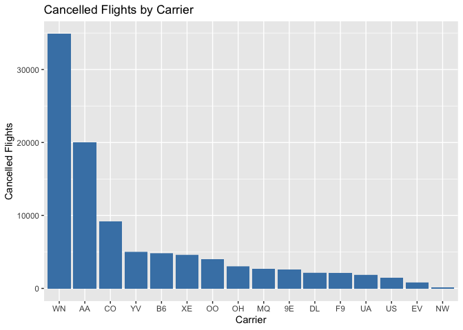
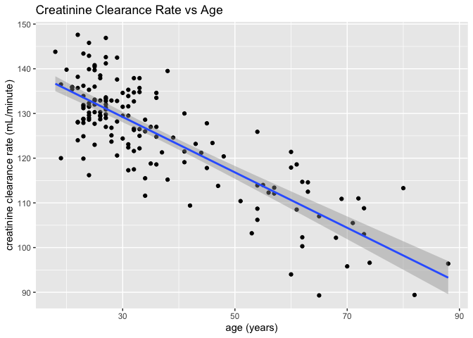
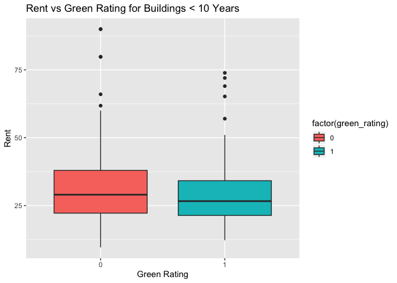

Exercise1
================

# Milk Report

## The Approach:

Using the guidelines from step 1 on the milk assignment, we used the
variables N: net profit, Q: quantity sold, and c: unit cost to form the
equation that follows. N = QP - Qc which simplifies to N = Q(P-C) P and
Q are coupled since the price of a product affects the amount sold. As
such, Q can be expressed as a function of P as follows: N = f(P) \* (P -
C)

We used a scatter plot to illustrate the relationship between P and Q.

``` r
plot(sales ~ price, data=milk)
```

<!-- -->

Since the distribution of the points closely resemble that of an
exponential function, we plotted another scatter plot comparing log(P)
and log(Q) to confirm our hypothesis and linearize the data.

``` r
plot(log(sales) ~ log(price), data=milk)

abline(lm(log(sales) ~ log(price), data=milk))
```

<!-- -->

The data illustrates a clear linear relationship between log(P) and
log(Q). We created a regression model and identified the coefficients to
find the parameters Beta 1 and Beta 0.

``` r
lm_ped = lm(log(sales) ~ log(price), data = milk)
coef(lm_ped)
```

    ## (Intercept)  log(price) 
    ##    4.720604   -1.618578

This can be illustrated as the following regression model: log(Q) = 4.72
- 1.62log(P) Q = e^(4.72) \* P^(-1.62) We can combine both the first and
second equations to illustrate N only in terms of P and c: N = (P-c) \*
110 \* P^(-1.62) With this equation, for any given unit cost c (consider
c = 1), we can calculate the max N by plotting a graph of the equation
and visually identifying the maximum.

``` r
curve((x-1)*110*x^(-1.62), from=2, to=3)
```

<!-- -->

From this graph, we can identify the max N as $2.61 for a given c of $1.
